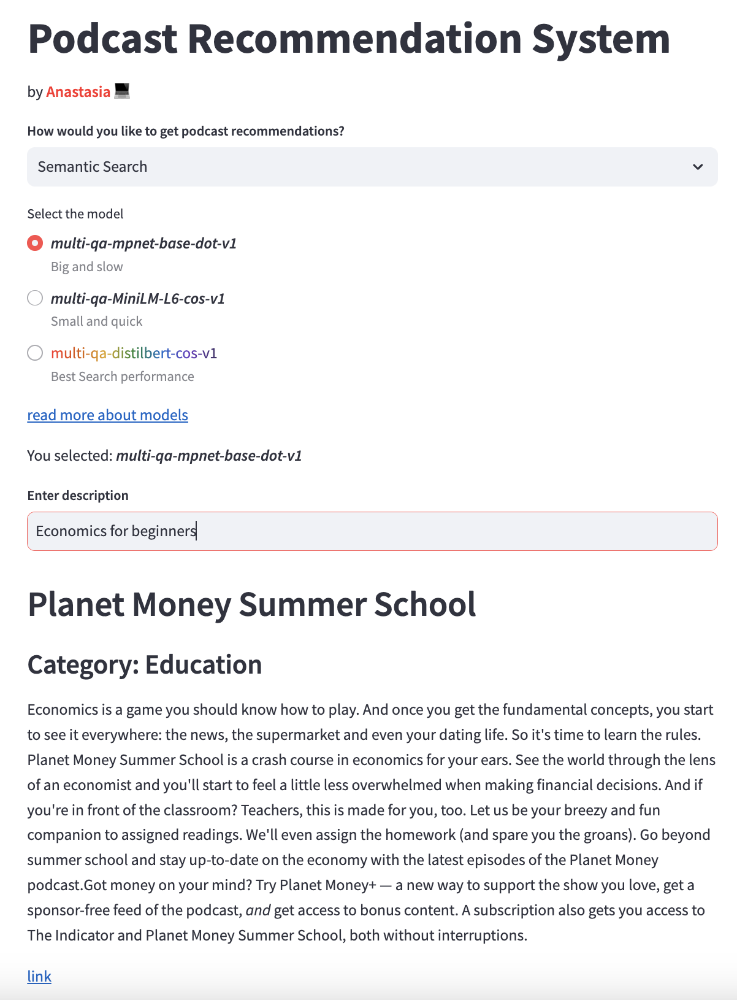

# Podcast recommendation system 
by Anastasia Karavdina

APP LINK : [Podcasts Recommendation Engine](https://XXX.streamlit.app/)

## Overview 

With the growth of podcasting over the past few years, it becomes increasingly difficult for users to discover new podcasts they may enjoy. Most listeners are cautious or hesitant to try new podcasts since they already have a small number of favorites. Users cannot listen to the first ten seconds or skim through the preview of a podcast, unlike with music or movies, to determine whether they would enjoy it. As a matter of fact, it happened to me while I was looking for french podcasts to learn the language. It might be difficult to match users with podcasts they would like because podcasts are typically lengthy and their topics vary widely. Additionally, due to the sheer volume of podcasts and podcast episodes, it's nearly impossible for users to navigate through them. However, we can potentially aggregate metadata about podcasts and employ various NLP techniques to recommend new, similar podcasts that they may enjoy.

## Data Collection

Data(15000+ podcasts and the metadata) was collected through web [scraping](data/extract_podcasts.py) from [itunes](https://podcasts.apple.com/us/genre/podcasts/id26).

Example sample data point:

{
  "id" : 'id1434243584,
  
  "name" : 'Lex Fridman Podcast',
  
  "url" : 'https://podcasts.apple.com/us/podcast/lex-fridman-podcast/id1434243584',
  
  "studio" : 'Lex Fridman',
  
  "category" :"Technology",
  
  "episode_count" : 300,
  
  "avg_rating" : 4.8,
  
  "total_ratings":8300,
  
  "description":'Conversations about science, technology, history, philosophy and the nature of intelligence, consciousness, love, and power. Lex is an AI researcher at MIT and beyond.'
}

## Data Exploration

Much of the initial exploration of the dataset was done in the notebook **EDA.ipynb** present in the notebooks folder. 

## Modelling

Elastic search is utilize for key-based search and 

### TF_IDF
TBA

### Sentence transformer model : [all-* ](https://www.sbert.net/docs/pretrained_models.html)

TBA

## Recommendations

TBA

## Model Evaluation

TBA

## Deployment

The web UI for the system was done on [Streamlit](https://podcasts-recommendation-system-using-tfidf-and-transformers.streamlit.app/)(app.py in src folder)
 

## Future Work

* Enable reqular data updates
* Sort out multi-language support
* Recommend podcast episodes (granular recommendations, user history for context)
* Collaborative filtering (with user review data)

## Authors

* **Anastasia Karavdina** 

## License

This project is licensed under the MIT License.

Project Organization
------------

    ├── LICENSE
    ├── Makefile           <- Makefile with commands like `make data` or `make train`
    ├── README.md          <- The top-level README for developers using this project.
    ├── data
    │   ├── processed      <- The final data sets for index
    │   └── raw            <- The original, immutable data dump.
    │   └── extract_podcasts.py            <- script to extract podcast data from itunes
    │
    ├── notebooks          <- Jupyter notebooks for EDA, data indexing, Model Evaluation, etc
    │
    ├── requirements.txt   <- The requirements file for reproducing the analysis environment, e.g.
    │                         generated with `pip freeze > requirements.txt`
    │
    ├── src                <- Source code for use in this project.
       ├── __init__.py    <- Makes src a Python module
       |-- app.py         <- Script for streamlit app
      

